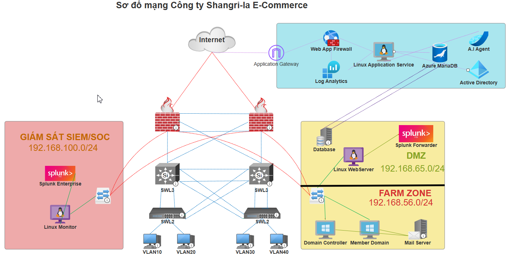
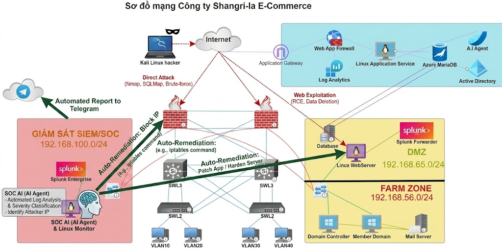

# 🛡️ Shangri-la Cyber Shield: Triển khai Bảo mật Doanh nghiệp & SOC

## 📌 Tổng quan Dự án
**Shangri-la Cyber Shield** là một dự án an ninh mạng và giám sát toàn diện, được thiết kế riêng cho nền tảng thương mại điện tử hiện đại xây dựng trên Node.js và Azure VM[cite: 6]. 

Vượt ra ngoài các lớp bảo mật thụ động, dự án này thiết lập một hệ sinh thái phòng thủ vững chắc dựa trên mô hình vận hành **Red Team vs. Blue Team**[cite: 6]. Dự án bao gồm mô phỏng các mối đe dọa, phản ứng sự cố tự động thông qua SOAR và AI Agent, cùng với quá trình Điều tra số (Digital Forensics) nghiêm ngặt, hướng tới việc đạt được kiến trúc Zero Trust[cite: 6].

## 🏗️ Kiến trúc Hybrid Cloud
Hạ tầng vận hành theo mô hình CNTT Lai (Hybrid IT) kết hợp giữa Microsoft Azure Cloud và mạng nội bộ (On-premise), được phân đoạn thành các vùng chuyên biệt[cite: 6]:
*   **Vùng Azure Cloud:** Lưu trữ ứng dụng Web thương mại điện tử công khai, được bảo vệ bởi Azure WAF, Application Gateway và Azure MariaDB[cite: 6].
*   **Vùng DMZ:** Hoạt động như vành đai nội bộ, lưu trữ Linux WebServer và Splunk Forwarder[cite: 6].
*   **Vùng FARM ZONE (Lõi):** Chứa các tài sản quan trọng bao gồm Active Directory Domain Controller, Member Domain, Mail Server và hệ thống lưu trữ Backup ngoại tuyến[cite: 6].
*   **Vùng SIEM/SOC:** Trung tâm giám sát và phản ứng sử dụng Splunk Enterprise, n8n (SOAR) và AI Agent để cảnh báo thời gian thực và cách ly tự động[cite: 6].

## ✨ Triển khai Bảo mật Trọng tâm (Blue Team)

### 1. Bảo mật Cloud & Ứng dụng Web
*   **Ngăn chặn SSRF:** Phòng chống Server-Side Request Forgery bằng cách cấu hình Azure WAF chặn truy cập vào IP Metadata của Azure (`169.254.169.254`) và nâng cấp lên giao thức IMDSv2[cite: 6].
*   **Phòng chống SQL Injection:** Triển khai Azure WAF với bộ quy tắc OWASP Core Rule Set (CRS) và áp dụng Prepared Statements ở backend Node.js để vô hiệu hóa các payload SQL độc hại[cite: 6].
*   **Bảo vệ chống DDoS (Slowloris):** Cấu hình giới hạn tốc độ Nginx (`limit_conn`, `limit_req`) và timeout ngắn, kết hợp với Azure Front Door, để loại bỏ các kết nối không hoàn chỉnh và ngăn chặn cạn kiệt tài nguyên[cite: 6].

### 2. Định danh & Bảo mật Mạng nội bộ
*   **Bảo vệ Active Directory:** Ngăn chặn các cuộc tấn công Brute-force và Kerberoasting bằng cách bắt buộc MFA, áp dụng chính sách Khóa tài khoản (GPO) nghiêm ngặt và nâng cấp lên chuẩn mã hóa Kerberos AES-256[cite: 6].
*   **Phòng chống MITM:** Vô hiệu hóa các cuộc tấn công giả mạo ARP (ví dụ: qua Ettercap) bằng cách bật Dynamic ARP Inspection (DAI) và DHCP Snooping trên Switch Cisco, song song với mã hóa HTTPS/TLS[cite: 6].
*   **Chặn Reverse Shell:** Áp dụng Egress Filtering và Deep Packet Inspection (DPI) trên tường lửa để chặn các kết nối ra ngoài tới các cổng đáng ngờ, ngăn chặn hiệu quả việc chiếm quyền điều khiển từ xa[cite: 6].

### 3. SOC Thông minh & Phản ứng Tự động (SOAR)
*   **SIEM Tập trung:** Sử dụng Splunk Enterprise để tổng hợp log thời gian thực từ Tường lửa, Web Server và Active Directory thông qua Universal Forwarder[cite: 6].
*   **Tự động hóa Honeypot & SOAR:** Triển khai OpenCanary làm bẫy mồi nhử (honeypot). Khi phát hiện xâm nhập, Splunk sẽ kích hoạt một script Python thông qua n8n (SOAR) sử dụng thư viện Netmiko để tự động tắt (shutdown) cổng switch Cisco bị xâm nhập[cite: 6].
*   **Tích hợp AI Agent:** Tích hợp ShellGPT và Llama 3 AI để phân tích log thô, trích xuất IP của kẻ tấn công và đẩy các cảnh báo hành động theo thời gian thực cho Blue Team qua bot Telegram[cite: 6].

### 4. Phục hồi sau thảm họa với Zero Trust
*   **Phân tích Sandbox cách ly:** Trong trường hợp cơ sở dữ liệu bị hỏng hoặc nhiễm mã độc, các bản sao lưu sẽ được khôi phục vào một môi trường Sandbox hoàn toàn cách ly[cite: 6].
*   **Xác minh bằng AI:** Llama 3 AI được sử dụng để quét các payload ngoại tuyến (ví dụ: Web Shells) nhằm tìm mã độc trước khi dữ liệu sạch được khôi phục lại môi trường thực tế (production) qua SCP/SSH[cite: 6].

## 🔎 Điều tra số (Digital Forensics)
Để điều tra các vi phạm mô phỏng, một quy trình điều tra số 4 bước nghiêm ngặt (Thu thập, Khảo sát, Phân tích, Báo cáo) đã được thực hiện bằng các công cụ chuyên dụng[cite: 6]:
*   **Điều tra Bộ nhớ & HĐH:** Sử dụng **FTK Imager** để dump RAM/Ổ đĩa và **Volatility** để phát hiện mã độc không dùng file (fileless malware) cùng các tiến trình ẩn[cite: 6].
*   **Điều tra Log & Cloud:** Sử dụng ngôn ngữ KQL trong Azure Log Analytics và Splunk để truy vết các nỗ lực SSRF và các lỗi xác thực AD (Event ID 4625, 4769)[cite: 6].
*   **Điều tra Mạng & Payload:** Phân tích các file PCAP bằng **Wireshark** để điều tra các cuộc tấn công MITM, và áp dụng **ExifTool/Binwalk** để trích xuất mã độc ẩn trong các tệp được tải lên[cite: 6].

## 🛠️ Công nghệ sử dụng
*   **Cloud & Hạ tầng:** Microsoft Azure (WAF, NSG, Front Door), Cisco IOS, Windows Server 2022, Ubuntu Linux[cite: 6].
*   **Bảo mật & SOC:** Splunk Enterprise, n8n (SOAR), Fortinet Firewall, OpenCanary, Netmiko[cite: 6].
*   **Điều tra số & Công cụ tấn công:** Kali Linux, Sqlmap, Burp Suite, Hydra, Hashcat, FTK Imager, Volatility, Wireshark[cite: 6].
*   **AI & Tự động hóa:** ShellGPT, Llama 3, Telegram API, Python[cite: 6].

## 📸 Hình ảnh Hệ thống

### 1. Sơ đồ Mạng Hybrid Cloud & SOC

### 2. Tự động hóa Cô lập Mối đe dọa với Honeypot & Netmiko

### 3. Bảng điều khiển Giám sát Splunk SIEM

## 👨‍💻 Nhóm 8 (Tác giả)
*   **Quách Thành Tân** (JK-ENR-HA-11618)[cite: 6]
*   **Nguyễn Việt Linh** (JK-ENR-HA-11617)[cite: 6]
*   **Trần Quốc Huy** (JK-ENR-HA-11617)[cite: 6]

*Được phát triển dưới dạng Đồ án Tài liệu Thiết kế Học kỳ IV tại Viện Đào tạo Quốc tế FPT Jetking.*[cite: 6]
